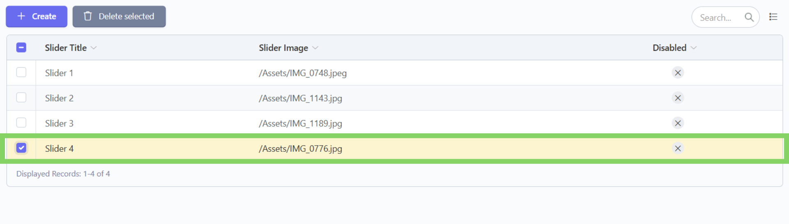
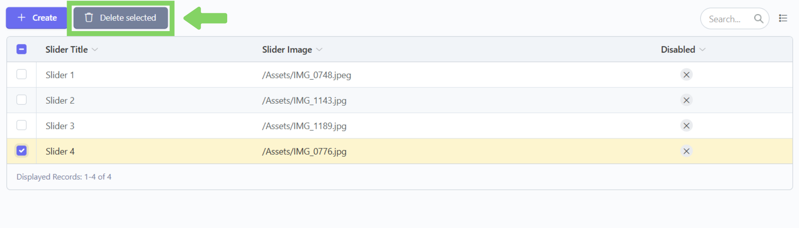
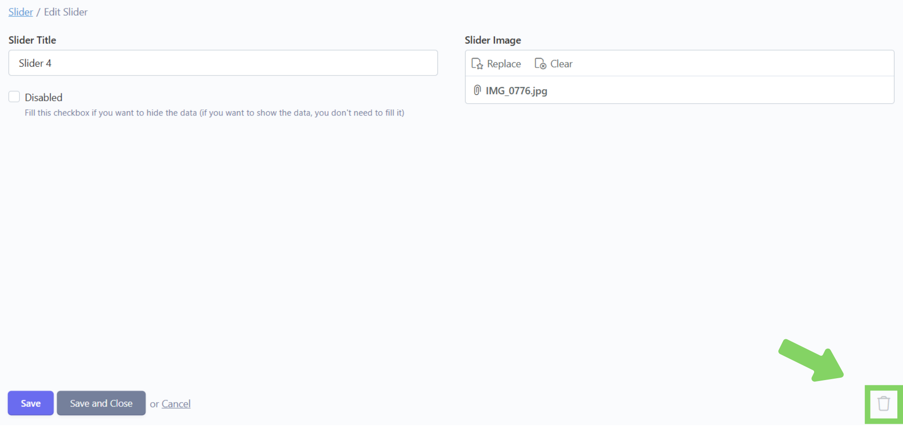

# 🗑️ Hapus



## Langkah 1: Klik menu "Edit"

Klik menu "Edit" di navbar.

<figure><figcaption></figcaption></figure>

## Langkah 2: Pilih bagian "Slider"

Pilih dan klik bagian "Slider".

<figure><figcaption></figcaption></figure>

## Langkah 3: Centang kotak centang konten yang ingin dihapus

Setelah masuk ke bagian "Slider",  akan tampil daftar konten yang telah ditambahkan. Lalu centang kotak centang disebelah kanan konten yang ingin dihapus.

<figure><figcaption></figcaption></figure>

## Langkah 4: Klik "Delete Selected"

Klik tombol "Delete Selected" disebelah tombol Create. Setelahnya akan ada pesan konfirmasi penghapusan dan klik "Ok".

<figure><figcaption></figcaption></figure>

## Langkah 5: Konten berhasil dihapus

Konten telah berhasil dihapus.

<figure><figcaption></figcaption></figure>



## Langkah 1: Klik menu "Edit"

Klik menu "Edit" di navbar.

<figure><figcaption></figcaption></figure>

## Langkah 2: Pilih bagian "Slider"

Pilih dan klik bagian "Slider".

<figure><figcaption></figcaption></figure>

## Langkah 3: Klik konten yang ingin dihapus

Setelah masuk ke bagian "Slider",  akan tampil daftar konten yang telah ditambahkan. Lalu klik dan masuk ke konten yang ingin dihapus.

<figure><figcaption></figcaption></figure>

## Langkah 4: Klik icon keranjang sampah

Klik tombol dengan icon keranjang sampah di pojok kanan bawah. Setelahnya akan ada pesan konfirmasi penghapusan dan klik "Ok".

<figure><figcaption></figcaption></figure>

## Langkah 5: Konten berhasil dihapus

Konten telah berhasil dihapus.

<figure><figcaption></figcaption></figure>


