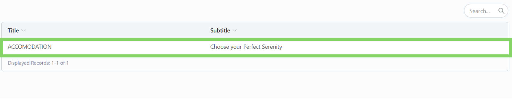
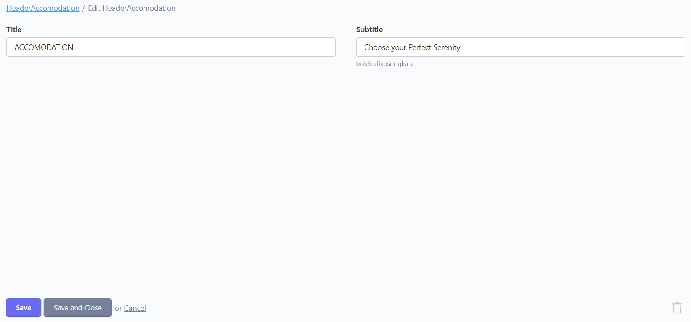
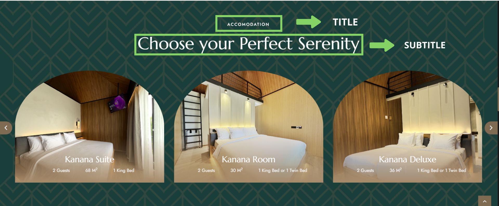
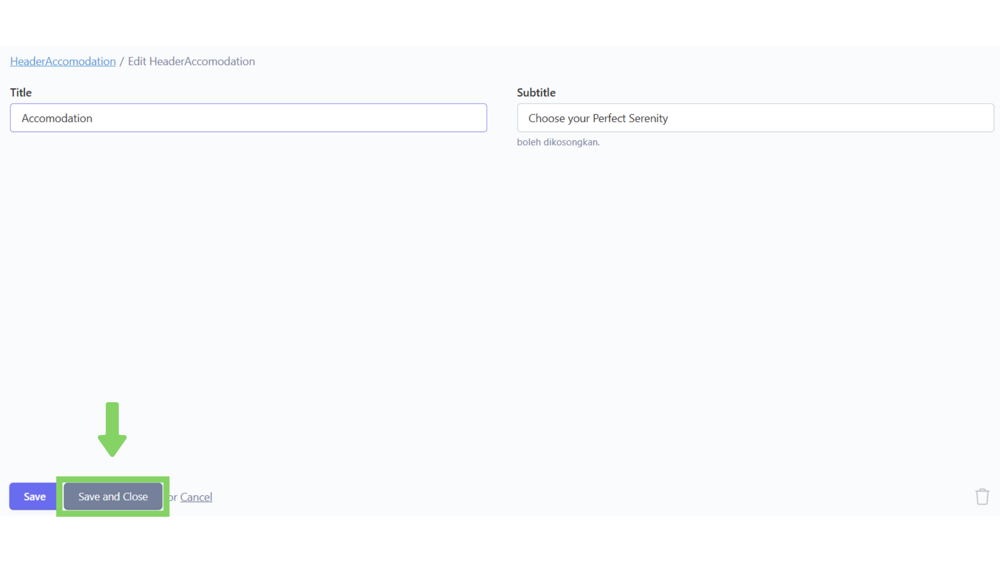
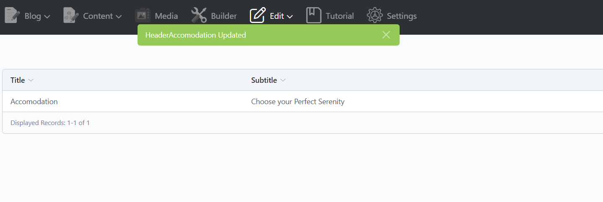

# 🖋️ Tulisan Accomodation

## Langkah 1: Klik menu "Edit"

Klik menu "Edit" di navbar.

<figure><figcaption></figcaption></figure>

## Langkah 2: Pilih bagian "H-Accomodation"

Pilih dan klik bagian "H-Accomodation".

<figure><figcaption></figcaption></figure>

## Langkah 3: Pilih konten yang ingin diubah

Setelah masuk ke bagian "H-Accomodation",  akan tampil daftar konten yang telah ditambahkan. Lalu, pilih dan klik konten yang ingin diubah.

<figure><figcaption></figcaption></figure>

## Langkah 4: Ubah isi konten

Setelah masuk ke dalam form, ubah isi konten sesuai dengan yang diinginkan.

<figure><figcaption></figcaption></figure>

<figure><figcaption></figcaption></figure>

Berikut adalah tipe form yang ada dan cara pengisiannya:



Untuk tipe form Teks (Title & Subtitle) kita tinggal mengetikkan saja kalimat yang kita ingin masukkan ke konten.

<figure><figcaption></figcaption></figure>



## Langkah 5: Klik "Save and Close"

Jika sudah selesai mengubah data, klik "Save and Close" untuk menyimpan dan kembali ke daftar konten.

> Tombol "Save" hanya berfungsi untuk menyimpan konten tanpa menavigasi kembali ke daftar konten.

<figure><figcaption></figcaption></figure>

## Langkah 6: Konten berhasil diubah

Konten telah berhasil diubah.

<figure><figcaption></figcaption></figure>
