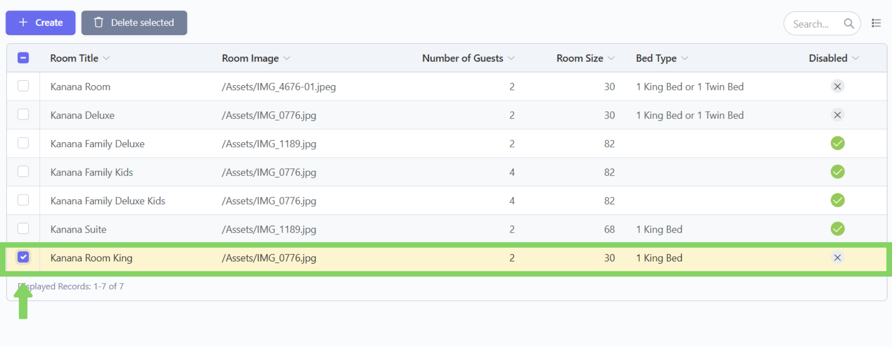
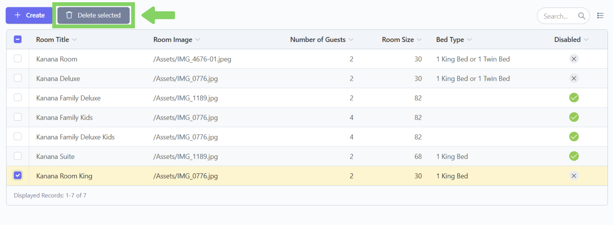
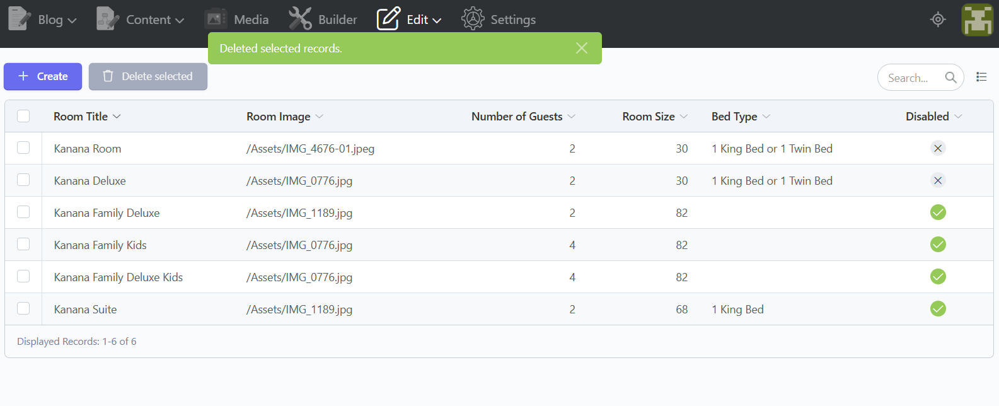
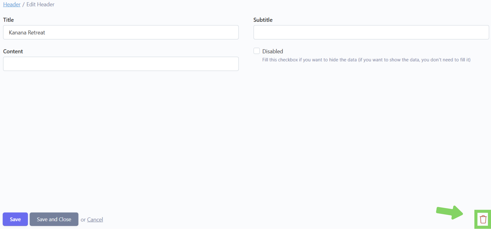
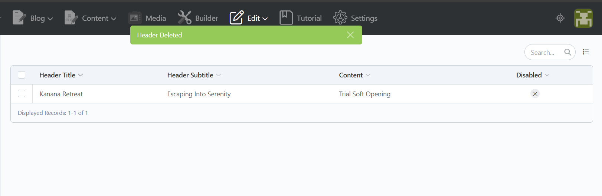

# 🗑️ Delete


Tidak dianjurkan untuk melakukan delete konten pada beberapa section konten dikarenakan tidak memiliki tombol "Create" untuk membuat konten baru, sehingga konten akan sepenuhnya menghilang dan tidak dapat menambahkan yang baru.\
Beberapa section konten yang tidak dianjurkan untuk melakukan delete:

* Header
* H-Accomodation
* H-Activity
* H-Explore Nearby




## Langkah 1: Klik menu "Edit"

Klik menu "Edit" di navbar.

<figure><figcaption></figcaption></figure>

## Langkah 2: Pilih section konten&#x20;

Pilih section konten mana yang ingin dihapus (contoh: kita pilih accomodation).

<figure><figcaption></figcaption></figure>

## Langkah 3: Centang kotak centang konten yang ingin dihapus

Setelah masuk ke section yang dipilih,  akan tampil list konten yang telah ditambahkan. Lalu centang kotak centang disebelah kanan konten yang ingin dihapus.

<figure><figcaption></figcaption></figure>

## Langkah 4: Klik "Delete Selected"

Lalu klik tombol "Delete Selected" disebelah tombol Create. Setelahnya akan ada pesan konfirmasi penghapusan dan klik "Ok".

<figure><figcaption></figcaption></figure>

## Langkah 5: Konten berhasil dihapus

Konten telah berhasil dihapus.

<figure><figcaption></figcaption></figure>



> Ada beberapa section yang tidak memiliki fitur Delete Selected sehingga bisa menggunakan cara ini untuk menghapus konten, yaitu:
>
> * Header
> * H-Accomodation
> * H-Activity
> * H-Explore Nearby

## Langkah 1: Klik menu "Edit"

Klik menu "Edit" di navbar.

<figure><figcaption></figcaption></figure>

## Langkah 2: Pilih section konten

Pilih section konten mana yang ingin dihapus (contoh: kita pilih header)

<figure><figcaption></figcaption></figure>

## Langkah 3: Klik konten yang ingin dihapus

Setelah masuk ke section yang dipilih,  akan tampil list konten yang telah ditambahkan. Lalu klik dan masuk ke konten yang ingin dihapus.

<figure><figcaption></figcaption></figure>

## Langkah 4: Klik icon keranjang sampah

Lalu, klik tombol dengan icon keranjang sampah di pojok kanan bawah. Setelahnya akan ada pesan konfirmasi penghapusan dan klik "Ok".

<figure><figcaption></figcaption></figure>

## Langkah 5: Konten berhasil dihapus

Konten telah berhasil dihapus.

<figure><figcaption></figcaption></figure>


