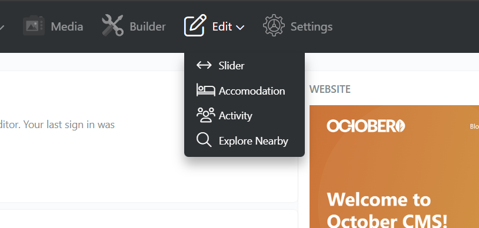
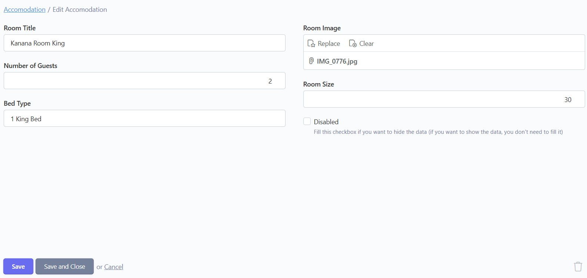
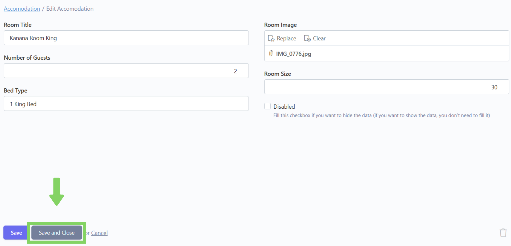

# 🖋️ Edit

## Langkah 1: Klik menu "Edit"

Klik menu "Edit" di navbar.

<figure><figcaption></figcaption></figure>

## Langkah 2: Pilih section konten&#x20;

Pilih section konten mana yang ingin diubah (contoh: saya pilih accomodation).

<figure><figcaption></figcaption></figure>

## Langkah 3: Klik konten yang ingin diedit

Setelah masuk ke section yang dipilih,  akan tampil list konten yang telah ditambahkan. Lalu klik konten yang ingin diedit.

<figure><figcaption></figcaption></figure>

## Langkah 4: Edit isi konten

Setelah masuk ke dalam form, edit isi konten yang ingin diubah.

<figure><figcaption></figcaption></figure>

## Langkah 5: Tambahkan foto Room Image

Jika ingin mengedit Room Image, klik "Replace", lalu Upload dulu gambar yang ingin ditambahkan sesuai kriteria ukuran gambar yang dibolehkan.

> **📓 Note**
>
> Kriteria Ukuran Gambar :&#x20;
>
> * Slider: 2000 x 1500&#x20;
> * Accomodation: 2000 x 1500&#x20;
> * Activity: 1500 x 1000&#x20;
> * Explore Nearby: 1024 x 768

<figure><figcaption></figcaption></figure>

Setelahnya klik gambar yang sudah diupload hingga berwarna kuning, terakhir klik "Insert" untuk menambahkan image ke form.

<figure><figcaption></figcaption></figure>

## Langkah 6: Kotak centang Disabled tidak perlu dicentang

Untuk bagian kotak centang Disabled tidak perlu di centang jika ingin menampilkan konten tersebut di website.

> Kotak centang Disabled hanya boleh dicentang dalam kondisi ingin menyembunyikan konten dari website tanpa menghapus konten dari database.

<figure><figcaption></figcaption></figure>

## Langkah 7: Klik "Create and Close"

Jika sudah selesai menginputkan data, klik "Create and Close" untuk menyimpan dan kembali ke list konten.

> Tombol "Create" hanya berfungsi untuk menyimpan konten tanpa menavigasi kembali ke list konten, dapat digunakan jika ingin menginputkan banyak konten (lebih dari satu kali).

<figure><figcaption></figcaption></figure>

## Langkah 8: Konten berhasil diubah

Konten telah berhasil diedit.

<figure><figcaption></figcaption></figure>
