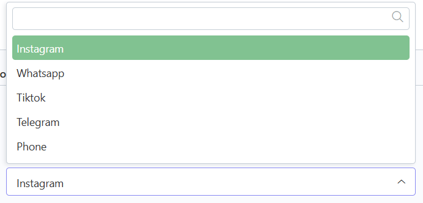

# 🖋️ Edit

## Langkah 1: Klik menu "Edit"

Klik menu "Edit" di navbar.

<figure><figcaption></figcaption></figure>

## Langkah 2: Pilih section konten&#x20;

Pilih section konten mana yang ingin diubah (contoh: kita pilih accomodation).

<figure><figcaption></figcaption></figure>

## Langkah 3: Klik konten yang ingin diedit

Setelah masuk ke section yang dipilih,  akan tampil list konten yang telah ditambahkan. Lalu klik konten yang ingin diedit.

<figure><figcaption></figcaption></figure>

## Langkah 4: Edit isi konten

Setelah masuk ke dalam form, edit isi konten yang ingin diubah.

<figure><figcaption></figcaption></figure>

Berikut beberapa tipe form yang ada dan cara pengisiannya:



Untuk tipe form Teks kita tinggal mengetikkan saja kalimat yang kita ingin masukkan ke konten.

<figure><figcaption></figcaption></figure>



Untuk tipe form Dropdown, akan terdapat pilihan yang telah disediakan dan kita tinggal memilih salah satu dari pilihan tersebut.

<figure><figcaption></figcaption></figure>



Untuk tipe form Image, ikuti langkah berikut untuk menambahkan Image ke dalam konten.

<figure><figcaption></figcaption></figure>

### Langkah 1: Upload Gambar

Klik Select, lalu Upload dulu gambar yang ingin ditambahkan sesuai kriteria ukuran gambar yang dibolehkan.

> **📓 Note**
>
> Kriteria Ukuran Gambar :&#x20;
>
> * Slider: 2000 x 1500&#x20;
> * Accomodation: 2000 x 1500&#x20;
> * Activity: 1500 x 1000&#x20;
> * Explore Nearby: 1024 x 768

<figure><figcaption></figcaption></figure>

### Langkah 2: Klik gambar yang telah berhasil diupload dan Klik "Insert"

Setelahnya klik gambar yang sudah diupload hingga berwarna kuning, terakhir klik "Insert" untuk menambahkan image ke form.

> Seluruh form yang bertipe image hanya dapat memasukkan satu gambar, kecuali pada form Room Images pada section Accomodation kita dapat memasukkan banyak gambar.

<figure><figcaption></figcaption></figure>



Untuk tipe form Repeater, kita dapat membuat banyak konten dalam satu form induk.

<figure><figcaption></figcaption></figure>

Untuk menambahkan konten klik Button "Add Social Media" lalu isi  form sesuai dengan data yang ingin dimasukkan.

<figure><figcaption></figcaption></figure>



Untuk tipe form Teks Editor kurang lebih sama seperti Teks, namun perbedaannya Teks Editor memiliki pengaturan tulisan untuk tulisannya (seperti bold, italic, dll.).

<figure><figcaption></figcaption></figure>



Untuk tipe form Disabled atau berupa check box  tidak perlu di centang jika ingin menampilkan konten tersebut di website.

> Kotak centang Disabled hanya boleh dicentang dalam kondisi ingin menyembunyikan konten dari website tanpa menghapus konten dari database.

<figure><figcaption></figcaption></figure>



## Langkah 5: Klik "Save and Close"

Jika sudah selesai menginputkan data, klik "Save and Close" untuk menyimpan dan kembali ke list konten.

> Tombol "Save" hanya berfungsi untuk menyimpan konten tanpa menavigasi kembali ke list konten.

<figure><figcaption></figcaption></figure>

## Langkah 6: Konten berhasil diubah

Konten telah berhasil diubah.

<figure><figcaption></figcaption></figure>
