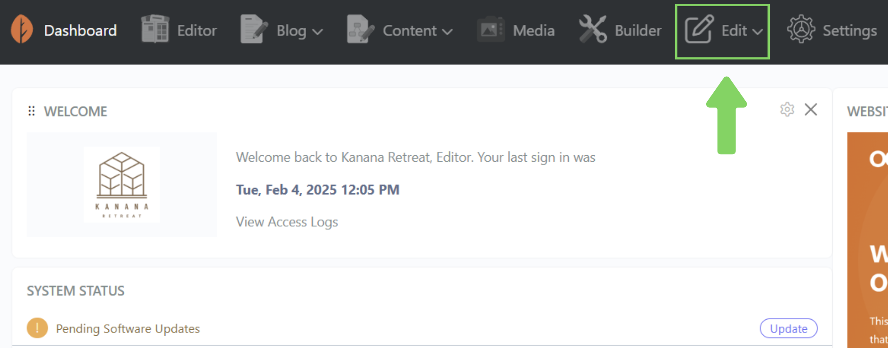
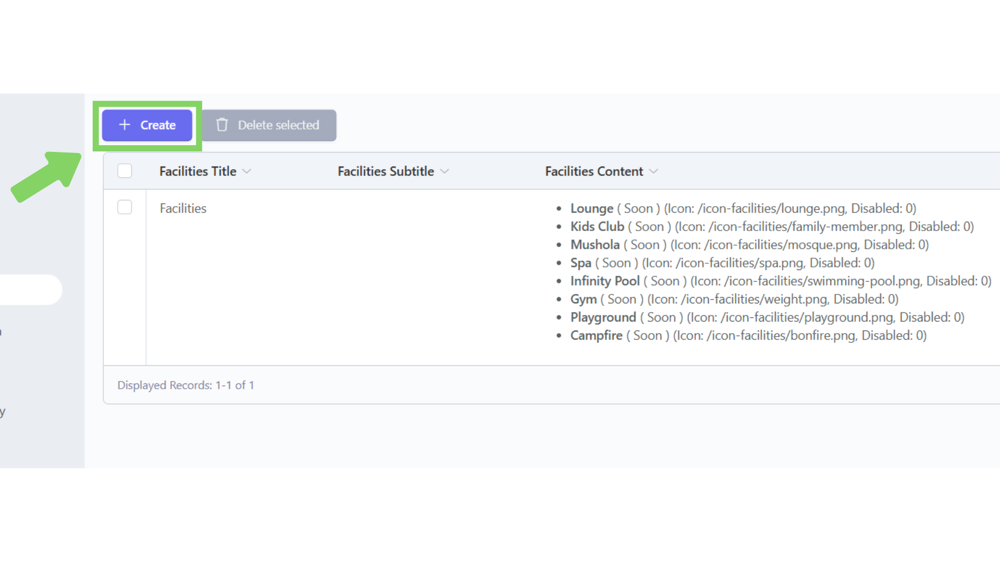
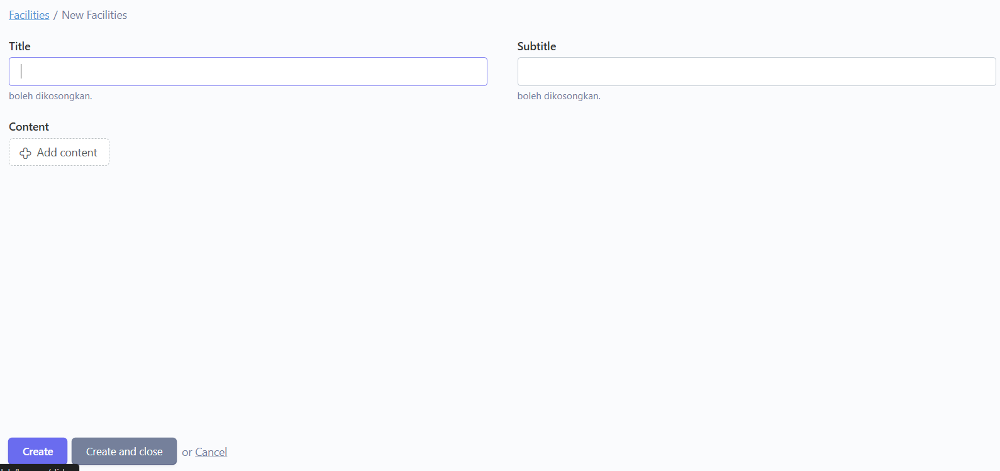
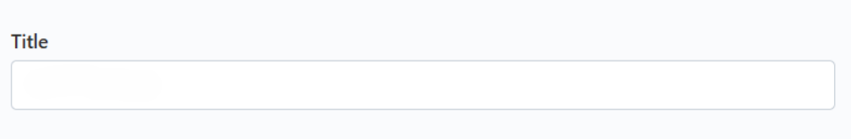
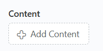
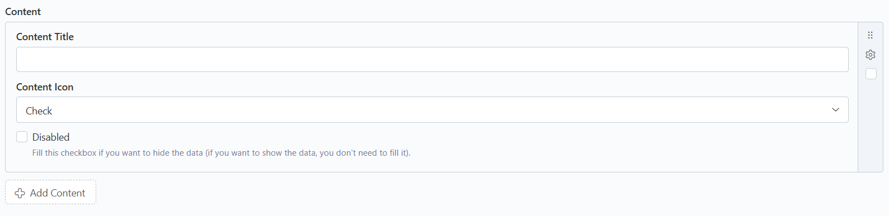
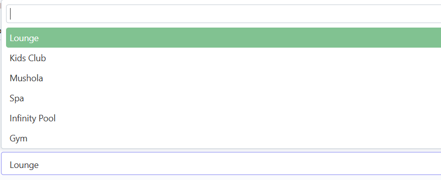
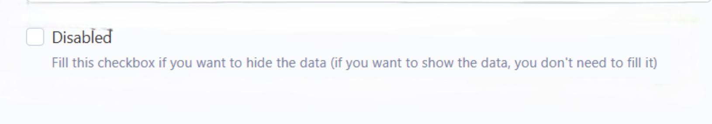
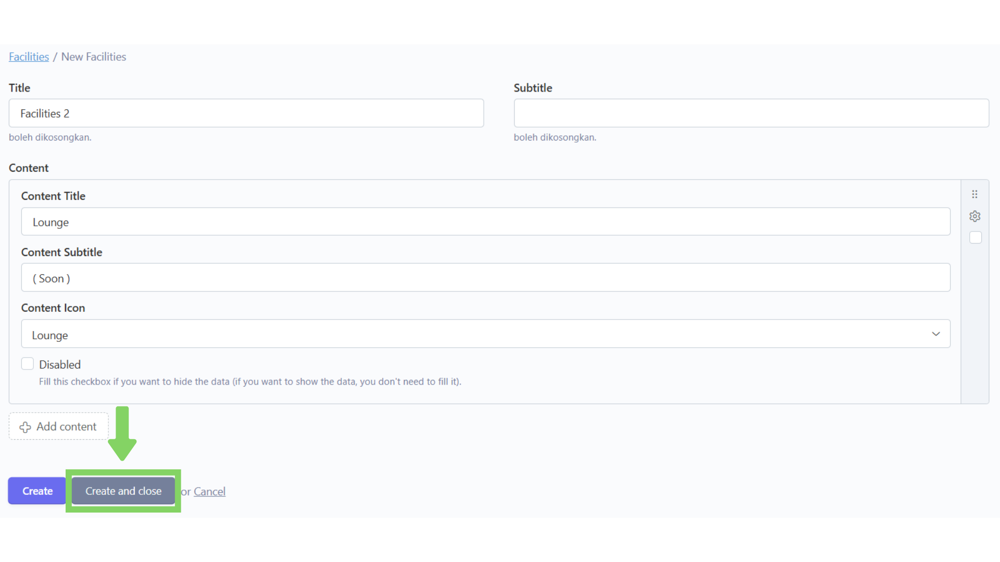
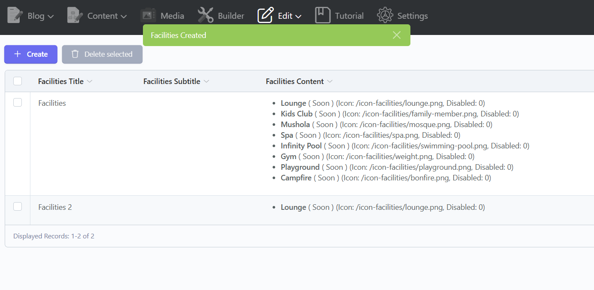

# ➕ Tambah

## Langkah 1: Klik menu "Edit"

Klik menu "Edit" di navbar.

<figure><figcaption></figcaption></figure>

## Langkah 2: Pilih bagian "Facilities"

Pilih dan klik bagian "Facilities".

<figure><figcaption></figcaption></figure>

## Langkah 3: Klik "Create"

Setelah masuk ke bagian "Facilities", akan tampil daftar konten yang telah ditambahkan. Lalu, klik "Create" untuk menambahkan konten baru.

<figure><figcaption></figcaption></figure>

## Langkah 4: Isi Form

Setelah masuk ke dalam form, isi form dengan data yang diinginkan.

<figure><figcaption></figcaption></figure>

Berikut beberapa tipe form yang ada dan cara pengisiannya:



Untuk tipe form Teks (Title, Subtitle, Content Title, Content Subtitle) kita tinggal mengetikkan saja kalimat yang kita ingin masukkan ke konten.

<figure><figcaption></figcaption></figure>



Untuk tipe form Repeater (Content), kita dapat membuat banyak konten dalam satu form induk.

<figure><figcaption></figcaption></figure>

Untuk menambahkan konten klik Button "Add Content" lalu isi  form sesuai dengan data yang diinginkan.

<figure><figcaption></figcaption></figure>



Untuk tipe form Dropdown (Content Icon), akan terdapat pilihan yang telah disediakan dan kita tinggal memilih salah satu dari pilihan tersebut.

<figure><figcaption></figcaption></figure>



Untuk tipe form Disabled atau berupa kotak centang tidak perlu di centang jika ingin menampilkan (aktivasi) konten tersebut di website.

> Kotak centang Disabled hanya boleh dicentang dalam kondisi ingin menyembunyikan (deaktivasi) konten dari website tanpa menghapus konten dari database.

<figure><figcaption></figcaption></figure>



## Langkah 5: Klik "Create and Close"

Jika sudah selesai menginputkan data, klik "Create and Close" untuk menyimpan dan kembali ke daftar konten.

> Tombol "Create" hanya berfungsi untuk menyimpan konten tanpa menavigasi kembali ke daftar konten.

<figure><figcaption></figcaption></figure>

## Langkah 6: Konten berhasil ditambahkan

Konten baru telah berhasil ditambahkan.

<figure><figcaption></figcaption></figure>
