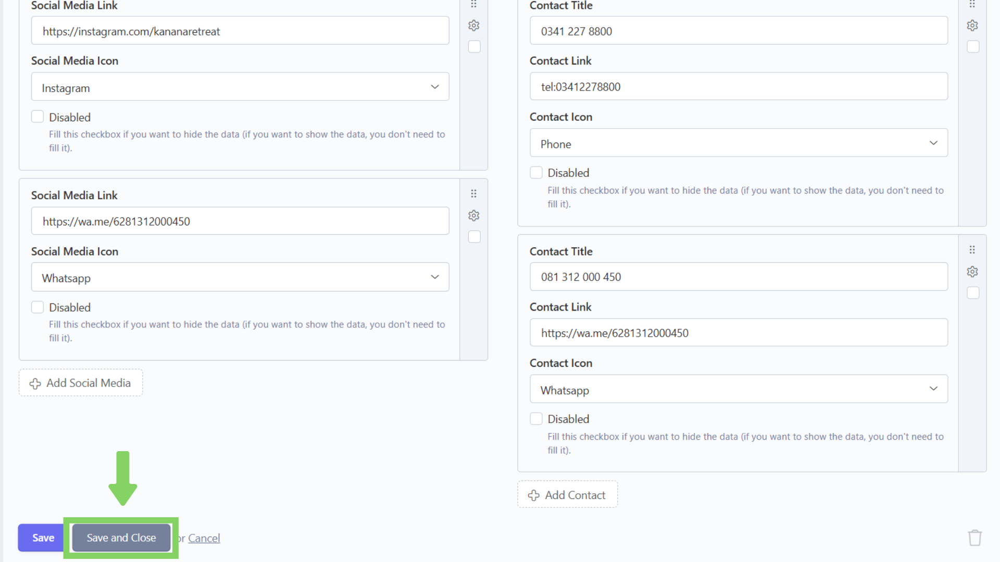

# Aktivasi / Deaktivasi

## Langkah 1: Klik menu "Edit"

Klik menu "Edit" di navbar.

<figure><figcaption></figcaption></figure>

## Langkah 2: Pilih bagian "Footer"

Pilih dan klik bagian "Footer".

<figure><figcaption></figcaption></figure>

## Langkah 3: Pilih konten yang ingin diaktivasi/dideaktivasi

Setelah masuk ke bagian "Footer",  akan tampil daftar konten yang telah ditambahkan. Lalu, pilih dan klik konten yang ingin konten contactnya diaktivasi / dideaktivasi.

<figure><figcaption></figcaption></figure>

## Langkah 4: Aktivasi / Deaktivasi konten

Setelah masuk ke dalam form, fokus pada bagian Disabled pada setiap konten di Contact.&#x20;

* Jika ingin melakukan aktivasi (menampilkan konten di website), maka tidak perlu mencentang kotak centang Disabled.
* Jika ingin melakukan deaktivasi (menyembunyikan konten di website), maka kita perlu untuk mencentang kotak centang Disabled.

<figure><figcaption></figcaption></figure>

## Langkah 5: Klik "Save and Close"

Jika sudah selesai mengubah data, klik "Save and Close" untuk menyimpan dan kembali ke daftar konten.

> Tombol "Save" hanya berfungsi untuk menyimpan konten tanpa menavigasi kembali ke daftar konten.

<figure><figcaption></figcaption></figure>
