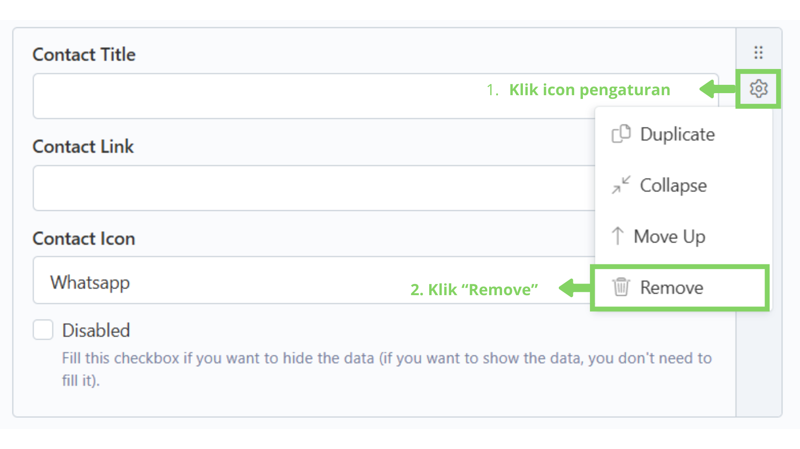

# 🗑️ Hapus

Langkah 1: Klik menu "Edit"

Klik menu "Edit" di navbar.

<figure><figcaption></figcaption></figure>

## Langkah 2: Pilih bagian "Footer"

Pilih dan klik bagian "Footer".

<figure><figcaption></figcaption></figure>

## Langkah 3: Pilih konten yang ingin dihapus contactnya

Setelah masuk ke bagian "Footer",  akan tampil daftar konten yang telah ditambahkan. Lalu, pilih dan klik konten yang ingin dihapus contactnya.

<figure><figcaption></figcaption></figure>

## Langkah 4: Klik icon pengaturan dan klik "Remove"

Setelah masuk ke dalam form, fokus pada form repeater contact. Lalu klik icon pengaturan (⚙️) disebelah kanan box konten dan klik "Remove".

<figure><figcaption></figcaption></figure>

## Langkah 5: Klik "Save and Close"

Jika sudah selesai menghapus konten, klik "Save and Close" untuk menyimpan dan kembali ke daftar konten.

> Tombol "Save" hanya berfungsi untuk menyimpan konten tanpa menavigasi kembali ke daftar konten.

<figure><figcaption></figcaption></figure>

## Langkah 6: Konten berhasil dihapus

Konten telah berhasil dihapus.

<figure><figcaption></figcaption></figure>
