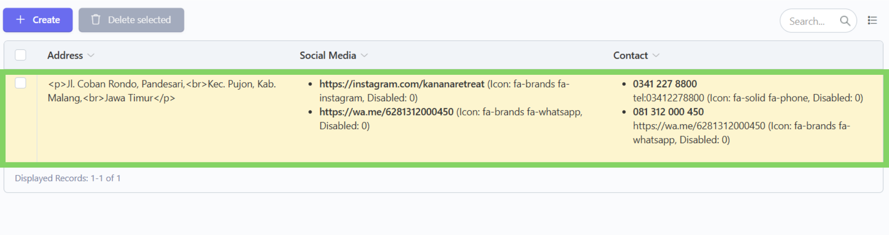
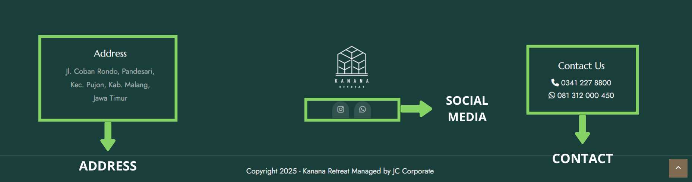
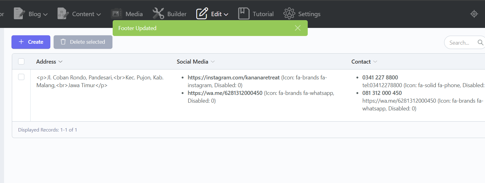

# ➕ Tambah

## Langkah 1: Klik menu "Edit"

Klik menu "Edit" di navbar.

<figure><figcaption></figcaption></figure>

## Langkah 2: Pilih bagian "Footer"

Pilih dan klik bagian "Footer".

<figure><figcaption></figcaption></figure>

## Langkah 3: Pilih konten yang ingin ditambahkan contact

Setelah masuk ke bagian "Footer",  akan tampil daftar konten yang telah ditambahkan. Lalu, pilih dan klik konten yang ingin ditambahkan contactnya.

<figure><figcaption></figcaption></figure>

## Langkah 4: Klik "Add Contact" dan isi form nya

Setelah masuk ke dalam form, fokus pada form repeater Contact. Lalu klik tombol "Add Contact" untuk menambahkan form contact yang baru dan isi form contact tersebut sesuai dengan yang diinginkan.

<figure><figcaption></figcaption></figure>

<figure><figcaption></figcaption></figure>

Berikut adalah tipe form yang ada dan cara pengisiannya:



Untuk tipe form Teks (Contact Title, Contact Link) kita tinggal mengetikkan saja kalimat yang kita ingin masukkan ke konten.

<figure><figcaption></figcaption></figure>



Untuk tipe form Repeater (Contact), kita dapat membuat banyak konten dalam satu form induk.

<figure><figcaption></figcaption></figure>

Untuk menambahkan konten klik Button "Add Content" lalu isi form sesuai dengan data yang diinginkan.

<figure><figcaption></figcaption></figure>



Untuk tipe form Dropdown (Contact Icon), akan terdapat pilihan yang telah disediakan dan kita tinggal memilih salah satu dari pilihan tersebut.

<figure><figcaption></figcaption></figure>



Untuk tipe form Disabled atau berupa kotak centang tidak perlu di centang jika ingin menampilkan (aktivasi) konten tersebut di website.

> Kotak centang Disabled hanya boleh dicentang dalam kondisi ingin menyembunyikan (deaktivasi) konten dari website tanpa menghapus konten dari database.

<figure><figcaption></figcaption></figure>



## Langkah 5: Klik "Save and Close"

Jika sudah selesai menambahkan data, klik "Save and Close" untuk menyimpan dan kembali ke daftar konten.

> Tombol "Save" hanya berfungsi untuk menyimpan konten tanpa menavigasi kembali ke daftar konten.

<figure><figcaption></figcaption></figure>

## Langkah 6: Konten berhasil ditambahkan

Konten telah berhasil ditambahkan.

<figure><figcaption></figcaption></figure>
