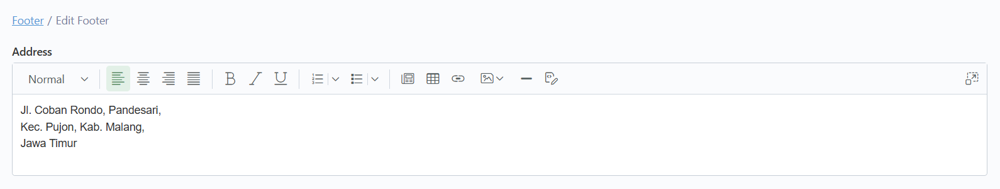

# 🖋️ Ubah Alamat&#x20;

## Langkah 1: Klik menu "Edit"

Klik menu "Edit" di navbar.

<figure><figcaption></figcaption></figure>

## Langkah 2: Pilih bagian "Footer"

Pilih dan klik bagian "Footer".

<figure><figcaption></figcaption></figure>

## Langkah 3: Pilih konten yang ingin diubah

Setelah masuk ke bagian "Footer",  akan tampil daftar konten yang telah ditambahkan. Lalu, pilih dan klik konten yang ingin diubah.

<figure><figcaption></figcaption></figure>

## Langkah 4: Ubah isi konten

Setelah masuk ke dalam form, ubah isi konten pada form Address sesuai dengan yang diinginkan.

<figure><figcaption></figcaption></figure>

Berikut adalah tipe form yang ada dan cara pengisiannya:



Untuk tipe form Teks Editor (Address) kurang lebih sama seperti Teks, namun perbedaannya Teks Editor memiliki pengaturan untuk tulisannya (seperti bold, italic, dll.).

<figure><figcaption></figcaption></figure>



## Langkah 5: Klik "Save and Close"

Jika sudah selesai mengubah data, klik "Save and Close" untuk menyimpan dan kembali ke daftar konten.

> Tombol "Save" hanya berfungsi untuk menyimpan konten tanpa menavigasi kembali ke daftar konten.

<figure><figcaption></figcaption></figure>

## Langkah 6: Konten berhasil diubah

Konten telah berhasil diubah.

<figure><figcaption></figcaption></figure>
