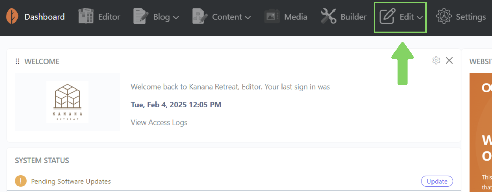
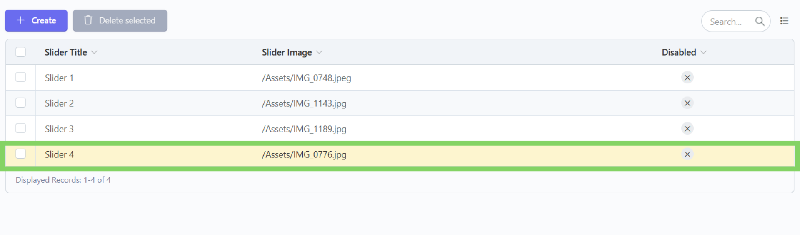
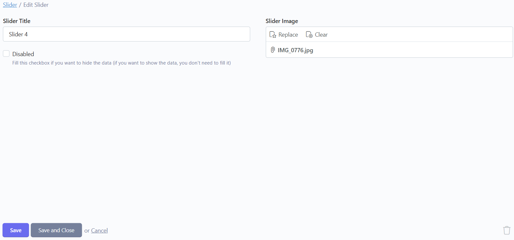
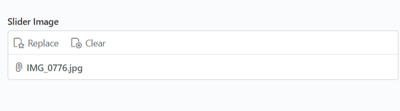
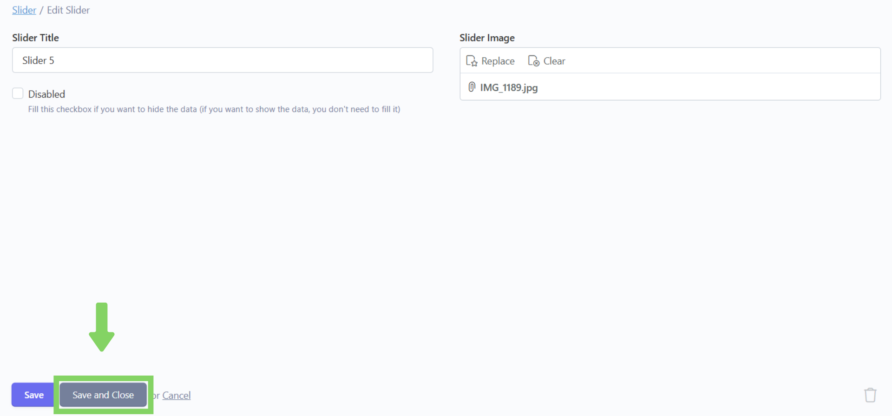
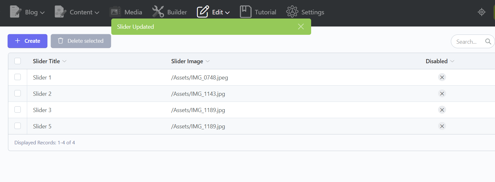

# 🖋️ Ubah

## Langkah 1: Klik menu "Edit"

Klik menu "Edit" di navbar.

<figure><figcaption></figcaption></figure>

## Langkah 2: Pilih bagian "Slider"

Pilih dan klik bagian "Slider".

<figure><figcaption></figcaption></figure>

## Langkah 3: Pilih konten yang ingin diubah

Setelah masuk ke bagian "Slider",  akan tampil daftar konten yang telah ditambahkan. Lalu, pilih dan klik konten yang ingin diubah.

<figure><figcaption></figcaption></figure>

## Langkah 4: Ubah isi konten

Setelah masuk ke dalam form, ubah isi konten sesuai dengan yang diinginkan.

<figure><figcaption></figcaption></figure>

Berikut beberapa tipe form yang ada dan cara pengisiannya:



Untuk tipe form Teks (Slider Title) kita tinggal mengetikkan saja kalimat yang kita ingin masukkan ke konten.

<figure><figcaption></figcaption></figure>



Untuk tipe form Image (Slider Image), ikuti langkah berikut untuk menambahkan Image ke dalam konten.

<figure><figcaption></figcaption></figure>

### Langkah 1: Upload Gambar

Klik Replace, lalu Upload dulu gambar yang ingin ditambahkan sesuai kriteria ukuran gambar yang dibolehkan.  Jika gambar sudah pernah di upload ke library atau sudah tersedia di library, maka langsung lakukan langkah ke-2.&#x20;

> **📓 Note**
>
> Kriteria Ukuran Gambar :&#x20;
>
> * Slider: 2000 x 1500&#x20;
> * Accomodation: 2000 x 1500&#x20;
> * Activity: 1500 x 1000&#x20;
> * Explore Nearby: 1024 x 768

<figure><figcaption></figcaption></figure>

### Langkah 2: Klik gambar yang telah berhasil diupload dan Klik "Insert"

Setelahnya klik gambar yang sudah diupload hingga berwarna kuning, terakhir klik "Insert" untuk menambahkan gambar ke form.

<figure><figcaption></figcaption></figure>



Untuk tipe form Disabled atau berupa check box  tidak perlu di centang jika ingin menampilkan (aktivasi) konten tersebut di website.

> Kotak centang Disabled hanya boleh dicentang dalam kondisi ingin menyembunyikan (deaktivasi) konten dari website tanpa menghapus konten dari database.

<figure><figcaption></figcaption></figure>



## Langkah 5: Klik "Save and Close"

Jika sudah selesai menginputkan data, klik "Save and Close" untuk menyimpan dan kembali ke daftar konten.

> Tombol "Save" hanya berfungsi untuk menyimpan konten tanpa menavigasi kembali ke daftar konten.

<figure><figcaption></figcaption></figure>

## Langkah 6: Konten berhasil diubah

Konten telah berhasil diubah.

<figure><figcaption></figcaption></figure>
