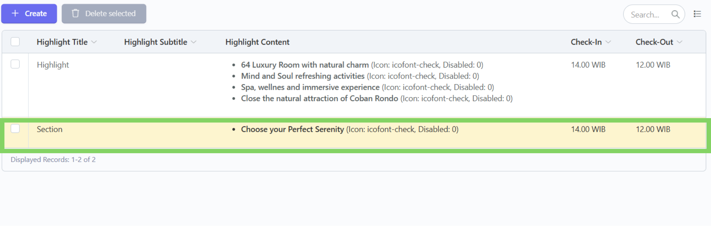
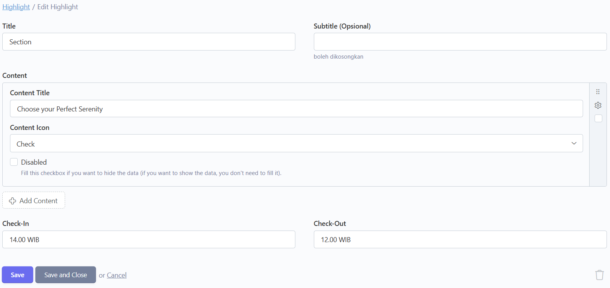
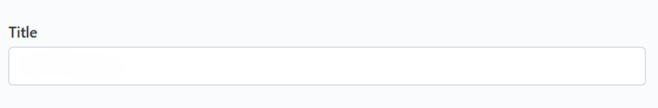
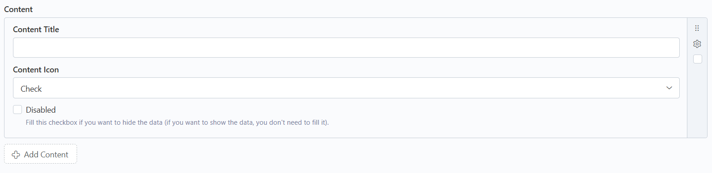
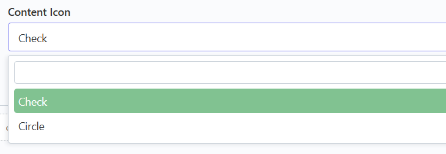
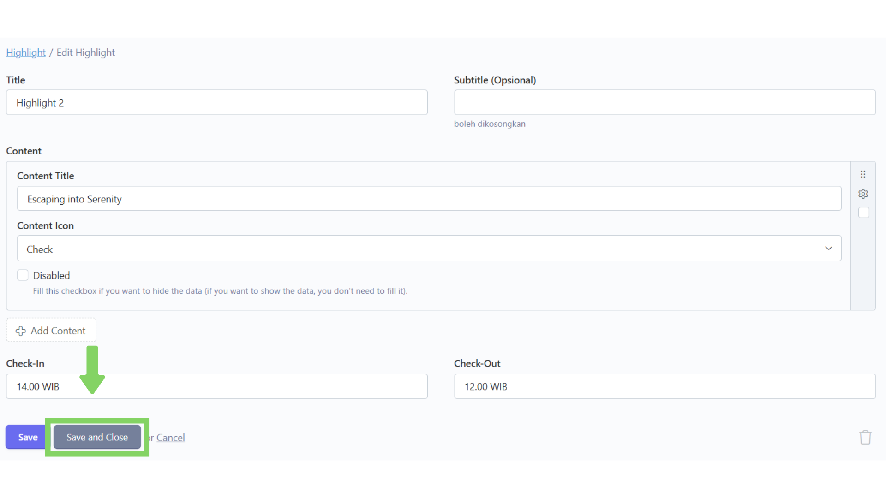

# 🖋️ Ubah

## Langkah 1: Klik menu "Edit"

Klik menu "Edit" di navbar.

<figure><figcaption></figcaption></figure>

## Langkah 2: Pilih bagian "Highlight"

Pilih dan klik bagian "Highlight".

<figure><figcaption></figcaption></figure>

## Langkah 3: Pilih konten yang ingin diubah

Setelah masuk ke bagian "Highlight",  akan tampil daftar konten yang telah ditambahkan. Lalu, pilih dan klik konten yang ingin diubah.

<figure><figcaption></figcaption></figure>

## Langkah 4: Ubah isi konten

Setelah masuk ke dalam form, ubah isi konten sesuai dengan yang diinginkan.

<figure><figcaption></figcaption></figure>

Berikut beberapa tipe form yang ada dan cara pengisiannya:



Untuk tipe form Teks (Title, Subtitle, Content Title, Check-In, Check-Out) kita tinggal mengetikkan saja kalimat yang kita ingin masukkan ke konten.

<figure><figcaption></figcaption></figure>



Untuk tipe form Repeater (Content), kita dapat membuat banyak konten dalam satu form induk.

<figure><figcaption></figcaption></figure>

Untuk menambahkan konten klik Button "Add Social Media" lalu isi  form sesuai dengan data yang diinginkan.

<figure><figcaption></figcaption></figure>



Untuk tipe form Dropdown (Content Icon), akan terdapat pilihan yang telah disediakan dan kita tinggal memilih salah satu dari pilihan tersebut.

<figure><figcaption></figcaption></figure>



Untuk tipe form Disabled atau berupa kotak centang tidak perlu di centang jika ingin menampilkan (aktivasi) konten tersebut di website.

> Kotak centang Disabled hanya boleh dicentang dalam kondisi ingin menyembunyikan (deaktivasi) konten dari website tanpa menghapus konten dari database.

<figure><figcaption></figcaption></figure>



## Langkah 5: Klik "Save and Close"

Jika sudah selesai mengubah data, klik "Save and Close" untuk menyimpan dan kembali ke daftar konten.

> Tombol "Save" hanya berfungsi untuk menyimpan konten tanpa menavigasi kembali ke daftar konten.

<figure><figcaption></figcaption></figure>

## Langkah 6: Konten berhasil diubah

Konten telah berhasil diubah.

<figure><figcaption></figcaption></figure>
